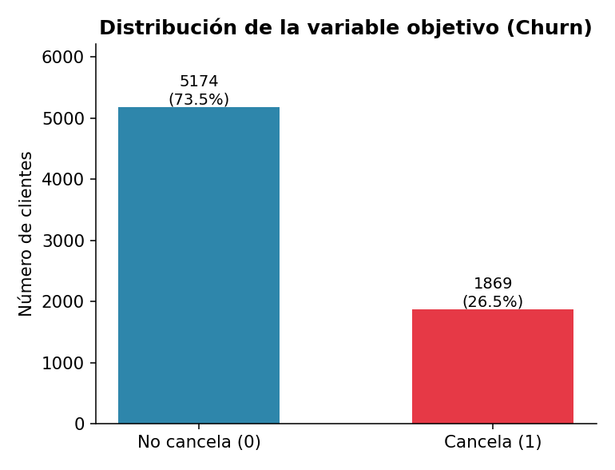
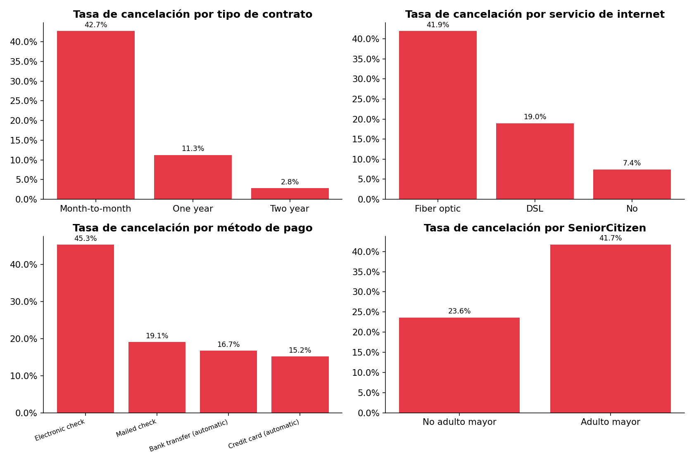
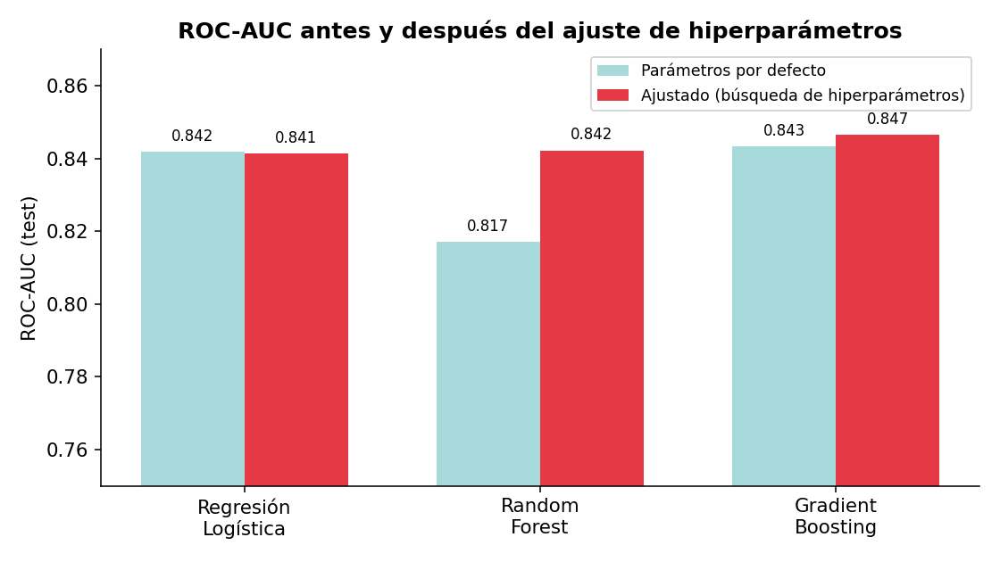
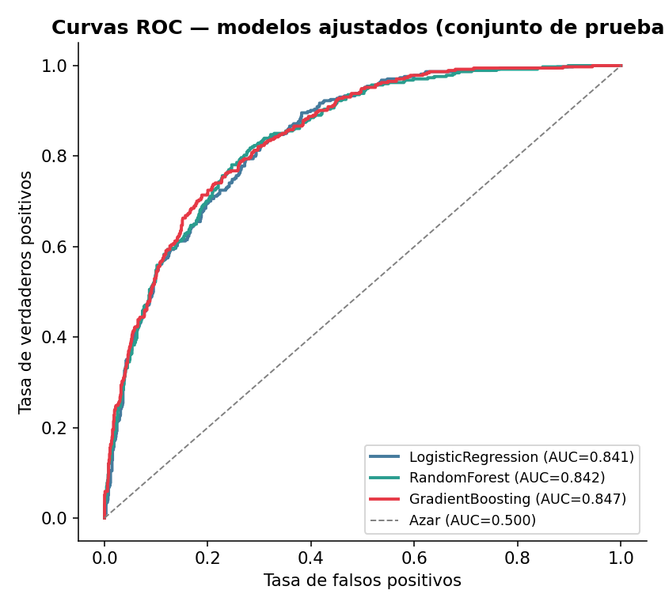
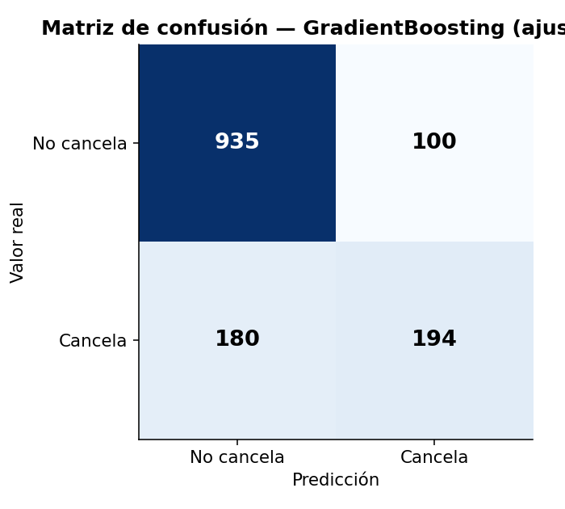
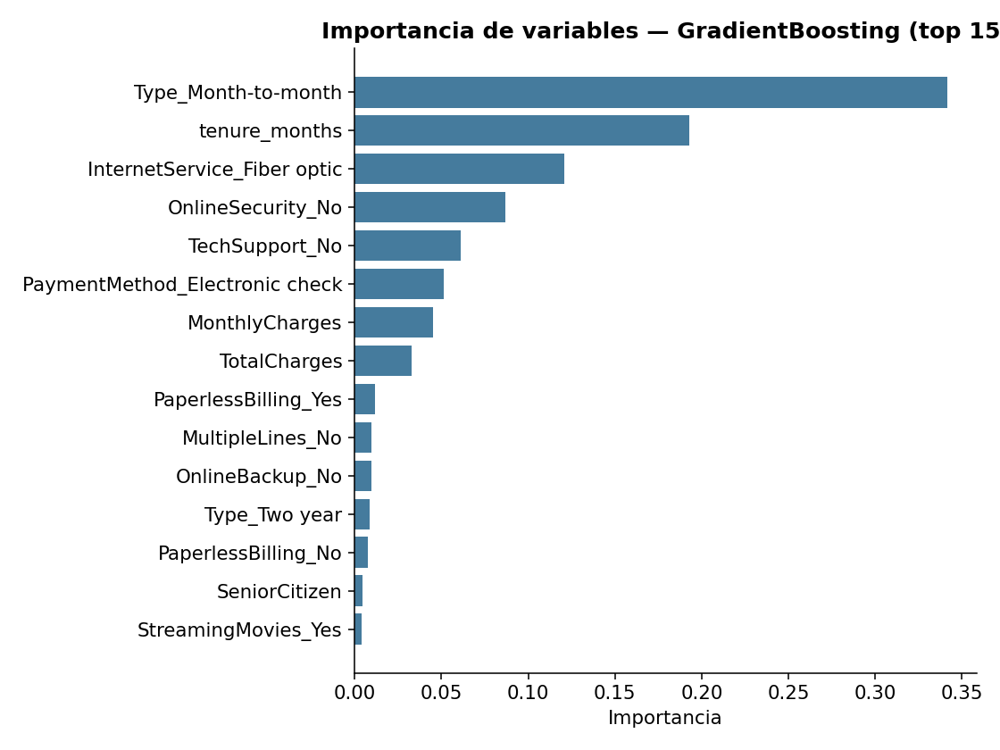

<div align="center">

# 📉 Predicción de cancelación de clientes (Churn) — Interconnect

**Modelo de clasificación para anticipar qué clientes tienen mayor probabilidad de cancelar su servicio, permitiendo campañas de retención proactivas.**


</div>

---

## 📑 Tabla de contenidos

- [Descripción del proyecto](#-descripción-del-proyecto)
- [Contexto de negocio](#-contexto-de-negocio)
- [Objetivo](#-objetivo)
- [Conjunto de datos](#️-conjunto-de-datos)
- [Metodología](#-metodología)
- [Resultados](#-resultados)
- [Insights y recomendaciones de negocio](#-insights-y-recomendaciones-de-negocio)
- [Tecnologías](#️-tecnologías)
- [Estructura del repositorio](#-estructura-del-repositorio)
- [Instalación y uso](#️-instalación-y-uso)
- [Próximos pasos](#-próximos-pasos)
- [Autor](#-autor)

---

## 📋 Descripción del proyecto

Este proyecto desarrolla un modelo de *machine learning* de extremo a extremo —desde la integración de datos crudos hasta la evaluación y explicabilidad del modelo final— para predecir la cancelación de clientes (**churn**) de un operador de telecomunicaciones ficticio, *Interconnect*. El flujo de trabajo cubre integración de múltiples fuentes de datos, tratamiento de valores nulos, ingeniería de variables, análisis exploratorio, y comparación de modelos con ajuste de hiperparámetros.

## 🏢 Contexto de negocio

Interconnect ofrece servicios de telefonía fija e internet (DSL y fibra óptica), además de servicios adicionales como seguridad en línea, soporte técnico y streaming. El equipo de marketing necesita **identificar con anticipación** a los clientes en riesgo de cancelación para poder retenerlos —mediante códigos promocionales o planes especiales— en lugar de reaccionar después de que ya se han ido, momento en el que recuperar al cliente es mucho más costoso que retenerlo.

## 🎯 Objetivo

Construir un modelo de clasificación binaria que prediga la variable `Churn` (1 = cancela, 0 = permanece activo), maximizando el **ROC-AUC** como métrica principal —adecuada dado el desbalance de clases (~26.5% de cancelación)— y reportando también **Accuracy** y **F1-score** como métricas complementarias.

---

## 🗂️ Conjunto de datos

Cuatro tablas provistas por la empresa, todas identificadas por `customerID`:

| Archivo | Contenido | Registros |
|---|---|---|
| `contract.csv` | Tipo de contrato, fechas de alta/baja, forma de pago, cargos | 7,043 |
| `personal.csv` | Datos demográficos del cliente | 7,043 |
| `internet.csv` | Servicios de internet contratados | 5,517 |
| `phone.csv` | Servicio telefónico contratado | 6,361 |

### Diccionario de variables (principales)

| Variable | Descripción |
|---|---|
| `Type` | Tipo de contrato: mes a mes, un año, dos años |
| `PaymentMethod` | Método de pago |
| `MonthlyCharges` / `TotalCharges` | Cargo mensual / cargo total acumulado |
| `InternetService` | Tipo de servicio de internet (DSL, fibra óptica, ninguno) |
| `OnlineSecurity`, `OnlineBackup`, `DeviceProtection`, `TechSupport`, `StreamingTV`, `StreamingMovies` | Servicios adicionales de internet |
| `MultipleLines` | Líneas telefónicas múltiples |
| `SeniorCitizen`, `Partner`, `Dependents`, `gender` | Datos demográficos |
| `tenure_months` *(creada en este proyecto)* | Antigüedad del cliente en meses |
| `Churn` *(variable objetivo)* | 1 = canceló el servicio, 0 = permanece activo |

> ⚠️ `internet.csv` y `phone.csv` no cubren a todos los clientes: la integración se realizó con `left join`, y los valores nulos resultantes (1,526 clientes sin internet, 682 sin teléfono) se trataron **de forma explícita según su causa** — por ejemplo, imputando `"No internet service"` en vez de eliminar filas o imputar con la moda — para no perder información predictiva real.

---

## 🔧 Metodología

**1. Integración de datos y variable objetivo**
`contract` como tabla base, unida con `personal`, `internet` y `phone`; `Churn` se deriva de `EndDate` (`"No"` → cliente activo).

**2. Tratamiento de valores nulos (post-integración)**

| Origen del nulo | Filas afectadas | Tratamiento |
|---|---|---|
| Sin servicio de internet | 1,526 | Imputación como `"No internet service"` / `"No"` |
| Sin servicio telefónico | 682 | Imputación como `"No phone service"` |
| Cliente recién dado de alta (sin facturación aún) | 11 | `TotalCharges = 0` |

**3. Ingeniería de variables**
Creación de `tenure_months` (antigüedad del cliente en meses, calculada a partir de `BeginDate`/`EndDate`) — resultó ser la **2ª variable más importante** del modelo final.

**4. Análisis exploratorio de datos (EDA)**
Distribución del objetivo, variables numéricas y tasas de cancelación por variable categórica (tipo de contrato, servicio de internet, método de pago, adulto mayor, facturación sin papel).

**5. Preparación para el modelado**
`Pipeline` + `ColumnTransformer` de scikit-learn: imputación + escalado para variables numéricas, imputación + *one-hot encoding* para categóricas — ajustado únicamente sobre datos de entrenamiento en cada partición de validación cruzada, evitando fuga de información.

**6. Modelado**
Regresión Logística, Random Forest y Gradient Boosting, entrenados primero con parámetros por defecto (*baseline*) y luego optimizados mediante `GridSearchCV` (Regresión Logística) y `RandomizedSearchCV` (Random Forest, Gradient Boosting) sobre validación cruzada estratificada (`StratifiedKFold`).

**7. Evaluación**
Comparación por Accuracy, F1 y ROC-AUC; curvas ROC, matriz de confusión e importancia de variables del modelo ganador.

---

## 📊 Resultados

### Distribución de la variable objetivo



El dataset está desbalanceado: **73.5%** de los clientes permanecen activos frente a **26.5%** que cancela — de ahí la importancia de reportar ROC-AUC y F1 además de Accuracy.

### Tasa de cancelación por variable categórica



Los clientes con **contrato mes a mes** cancelan un **42.7%** de las veces (vs. 2.8% en contratos de dos años); los de **fibra óptica**, un **41.9%**; y quienes pagan por **cheque electrónico**, un **45.3%** — las señales más fuertes del análisis.

### Comparación de modelos: antes y después del ajuste de hiperparámetros



| Modelo | Accuracy | F1 | ROC-AUC |
|---|---|---|---|
| **Gradient Boosting** (ajustado) | 0.8013 | 0.5808 | **0.8465** |
| Random Forest (ajustado, balanceado) | 0.7601 | **0.6310** | 0.8422 |
| Regresión Logística (ajustada) | 0.8055 | 0.6029 | 0.8414 |

**Gradient Boosting** obtiene el mejor ROC-AUC y se recomienda para el *scoring* general de riesgo de cancelación. **Random Forest** con `class_weight='balanced'` logra el mayor F1-score (mejor *recall* sobre clientes que sí cancelan) — relevante si el costo de **no detectar** a un cliente en riesgo supera al de ofrecerle una promoción de más.

### Curvas ROC y matriz de confusión (modelo final)

<p align="center">
  
  
</p>

De 374 clientes que efectivamente cancelaron en el conjunto de prueba, el modelo identifica correctamente a 194 (*recall* ≈ 52%), dejando 180 falsos negativos — la referencia clave para decidir si conviene ajustar el umbral de decisión en producción.

### Importancia de variables



Las variables más determinantes coinciden con los hallazgos del EDA: **contrato mes a mes**, **antigüedad del cliente** (`tenure_months`, creada en este proyecto) y **fibra óptica** concentran la mayor parte del poder predictivo.

---

## 💡 Insights y recomendaciones de negocio

- **Priorizar retención** en clientes con contrato mes a mes, fibra óptica, pago por cheque electrónico y menos de ~18 meses de antigüedad: es el perfil de mayor riesgo identificado tanto en el EDA como en la importancia de variables del modelo.
- **Incentivar contratos de mayor plazo**: la tasa de cancelación baja de 42.7% (mes a mes) a 2.8% (dos años).
- **Investigar la fricción en fibra óptica y cheque electrónico** (precio, competencia, experiencia de pago), ya que son palancas de negocio accionables, no solo señales predictivas.

---

## 🛠️ Tecnologías

- **Python** 3
- **pandas**, **numpy** — manipulación de datos
- **scikit-learn** — `Pipeline`, `ColumnTransformer`, `GridSearchCV`, `RandomizedSearchCV`, modelos de clasificación
- **matplotlib** — visualización

## 📁 Estructura del repositorio

```
├── interconnect_churn_final.ipynb   # Notebook con el análisis y modelado completos
├── contract.csv
├── personal.csv
├── internet.csv
├── phone.csv
├── assets/                          # Gráficos usados en este README
└── README.md
```

## ▶️ Instalación y uso

```bash
git clone https://github.com/Guillermo-Chavez/Prediccion-de-cancelacion-de-clientes.git
cd Prediccion-de-cancelacion-de-clientes
pip install pandas numpy scikit-learn matplotlib jupyter
jupyter notebook interconnect_churn_final.ipynb
```

## 📈 Próximos pasos

- Ampliar la búsqueda de hiperparámetros (más iteraciones y particiones de validación cruzada).
- Ajustar el umbral de clasificación en función del costo de negocio real de cada tipo de error (falso positivo vs. falso negativo).
- Monitorear el modelo en producción y reentrenarlo periódicamente a medida que cambien los patrones de cancelación.

---

## 👤 Autor

**Guillermo Chávez** — Data Scientist Jr.
📧 [memo_akita99@outlook.com](mailto:memo_akita99@outlook.com) · 💼 [LinkedIn](https://www.linkedin.com/in/guillermo-rafael-chavez-akita/) 
